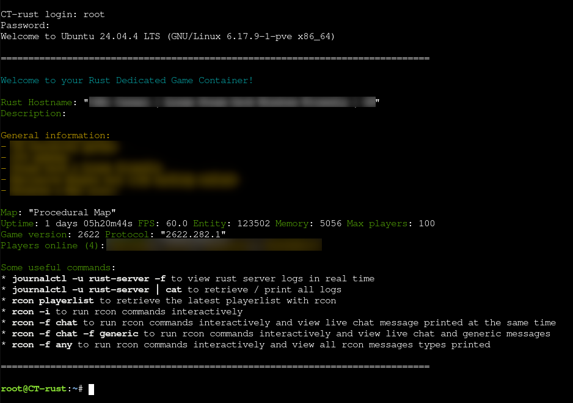

# Another Rust Game Dedicated Server Container (for podman & LXC)

NOTE! It seems the container works better with podman on linux or LXC(Proxmox), those are the 2 I am using and tested.
For Docker, we have to set some extra permissions, which may seems like more privilege for some reasons. The run.sh command has been updated to work with Docker, but podman or LXC is recommended since their out of the box experience is considered unprivileged and these container tools were more designed to run containers using systemd init as an entrypoint.

## Screenshot


```
systemd─┬─bash─┬─RustDedicated
        │      └─auto_updater
        ├─nginx───nginx
        └─systemd-journal
```

## Introduction

Why create a new Rust Dedicated server container and not just use linux GSM?

Because!!!!!!

There is probably no real reason, I've used LinuxGSM before, but also the old didstopia docker image from which this is based on because I was mostly familiar with that one.
I just wanted to customize a rust server that would allow linux and steamdeck players to be able to join out of the box, while still allowing the few Windows users out there to join normally.

I also wanted to have this container to use a main rust.env file to set everyting which can be mounted as a filesystem and would be read on each game restart, and not statically set on a "docker run" command for example.

This new container image uses the latest Ubuntu 24.04 LTS base, and node.js 24 for the management apps (the didstopia images do not seems to be maintained anymore)

It also run with a full systemd init which allow to run rust as a systemd service and have all the convenience of restarting it with expential backoffs, logging using journalctl with timestamps, etc. I was against that idea originally, as I prefered to have a simple bash entrypoint... but wrapping all logs properly with timestamps and everything else I wanted turned out to be very hugly and clunky... and after trying out the default Ubuntu container image in Proxmox CT with LXC, I really liked the idea of having a full systemd, and found that the number of processes is very low, and the startup time is almost instant. And since Rust takes a very long time to start and uses a lot of memory and disk space (in comparison), I did not see any reason to try to cut the corners.

The container also has a ssh server pre-installed and accessible, althought by default there is no credentials allowed.

I also focused on hosting this container with Proxmox VE and the built-in LXC containers, as it makes for a very efficient hosting solution compared to hosting this inside a vm in docker like I was doing before.

## Quick start

To download the image from github and run it locally on your podman, simply run the following command:

```
./run.sh
```
If you didn't clone this repo, you can run this command instead, which will get the run.sh and then run it:
```
curl -s https://raw.githubusercontent.com/Gerporgl/rust-dedicated-game-container-linux/refs/heads/master/run.sh > /tmp/_rrun.sh && bash  /tmp/_rrun.sh
```

It will prompt you to set a root password, and will create a subfolder rust_data which will contain all the rust server files that you want to persist and care about.

An important detail to understand is that the root password is not set into the docker image itself, but is set at runtime. You can take a look inside run.sh to see how it's done.

After the server started, it will download rust and enable the Carbon plugin framework with the correct configs to allow linux players to join, you can disable that in the rust.env if this is not what you want.

A default rust.env will be placed in ./rust_data/rust.env that you can edit afterward.
A new world seed will be generated, and a random rcon password as well.
Again, all of those can be changed, and the server just needs to be restarted to apply the new changes.

The webrcon will be accessible at http://localhost:8080 and the password is available in the rust.env file generated.

To view the rust server logs, you can run the following commands inside the container:

To view live logs in real time
```
journalctl -u rust-server -f
```

To grab all logs
```
journalctl -u rust-server | cat
```

To view normally
```
journalctl -u rust-server
```

## Advanced use & other details

### Building your own docker image locally

To build the image, and run the rust server, simply run the following command:
```
./build_and_run.sh
```

It will take some time to start as it needs to build the docker image first. Afterward you can use run_local.sh directly

If you only want to build the image, use:
```
./build.sh
```

### rcon command

You can use the command line version of rcon, inside the container in a terminal.
For example:
```
rcon players
```
This should return the list of players on your server, if any.

You can also now run rcon interractively:
```
rcon -it
```

If you like this container image and it works well for you, you are welcome to "star" this repo, this will make me feel good :relaxed:

### Setup your ssh public key to connect with ssh

An example can be found in run_with_ssh.sh (TODO)

### rust.env configuration details

The server configuration is managed through the `rust.env` file, located under `/home/steam/steamcmd/rust/rust.env`. Below is a detailed breakdown of all available variables:

---

| Variable | Default | Category | Description |
|----------|---------|----------|-------------|
| **Server Ports** |
| `RUST_SERVER_PORT` | `28015` | Network | Main game server port (UDP) |
| `RUST_SERVER_QUERYPORT` | `28016` | Network | Query port for browser connectivity |
| `RUST_SERVER_RCON_PORT` | `28666` | Network | RCON remote console port |
| `RUST_SERVER_APP_PORT` | `28017` | Network | Rust Companion app port |
| **World Settings** |
| `RUST_SERVER_SEED` | *Random on start* | World | Map seed (integer) |
| `RUST_SERVER_WORLDSIZE` | `4000` | World | Map size (integer) |
| `RUST_SERVER_LEVEL_URL` | *Empty* | World | Custom map URL (overrides seed/worldsize) |
| `RUST_SERVER_MAXPLAYERS` | `100` | World | Maximum players |
| `RUST_SERVER_SAVE_INTERVAL` | `600` | World | Auto-save interval in seconds |
| **Server Identity** |
| `RUST_SERVER_IDENTITY` | `default` | Identity | Save directory name |
| `RUST_SERVER_NAME` | `Dynamic` | Identity | Public server name |
| `RUST_SERVER_DESCRIPTION` | *Multi-line* | Identity | Public server description |
| `RUST_SERVER_URL` | `rustmaps.com` | Identity | Server website URL |
| `RUST_SERVER_BANNER_URL` | *Empty* | Identity | Banner image URL |
| **Startup Arguments** |
| `RUST_SERVER_STARTUP_ARGUMENTS` | *See default.env* | Server | Arguments passed on startup |
| **Updates** |
| `RUST_UPDATE_CHECKING` | `1` | Updates | Enable automatic update checking |
| `RUST_UPDATE_BRANCH` | `public` | Updates | Update branch to use |
| `RUST_HEARTBEAT` | `0` | Updates | Enable heartbeat monitoring |
| **Plugin Systems** |
| `RUST_CARBON_ENABLED` | `1` | Plugins | Enable Carbon plugin framework |
| `RUST_CARBON_UPDATE_ON_BOOT` | `1` | Plugins | Auto-update Carbon on boot |
| `RUST_CARBON_BRANCH` | *Empty* | Plugins | Carbon branch |
| `RUST_OXIDE_ENABLED` | `0` | Plugins | Enable Oxide mod framework |
| `RUST_OXIDE_UPDATE_ON_BOOT` | `1` | Plugins | Auto-update Oxide on boot |
| **RCON** |
| `RUST_RCON_WEB` | `1` | RCON | Enable web-based RCON interface |
| `RUST_RCON_PASSWORD` | *Auto-generated* | RCON | RCON password |
| `RUST_RCON_SECURE_WEBSOCKET` | `0` | RCON | Secure WebSocket connections |
| **Server Mode** |
| `RUST_START_MODE` | `0` | Mode | `0`=update+start, `1`=update only, `2`=start only |

---

> **Note**: All variables shown with `${VARIABLE}` syntax support variable expansion. This means you can use `${RUST_SERVER_SEED}` in your server name, description, or URL, and they will be replaced with the actual value when the server starts.

---

## Special Wipe and Recovery Trigger Files

The `rust-game` script monitors for special trigger files in `$STEAMCMDDIR/rust/` on startup. These provide manual control over server resets and data management without needing to access the file system directly. All triggers are automatically cleaned up after processing.

### force_full_wipe

Force a full wipe, including blueprints

**Effect:** World and blueprints are reset.

### force_map_wipe

Creates a **map wipe only** - resets the world map but preserves blueprints progression.

**Effect:** World regenerates from scratch, but players retain blueprints progression.

For both types of wipe, a backup of the deleted file is created, if you ever need to recover some of them.

### force_redownload

Triggers a **clean re-download** of all Rust game binaries, bundles, and packages. This forces SteamCMD to fetch fresh files when experiencing corruption or update issues.

**Important:** All **configs, maps, settings, and plugins are preserved**. Only the game binary files are affected.

---

## How to Use Trigger Files

Place an empty file in the server's rust folder. The script detects and processes each trigger on every container restart:

```bash
# Full wipe - use when completely resetting the server
touch /home/steam/steamcmd/rust/force_full_wipe

# Map wipe - refresh world map while keeping player data
touch /home/steam/steamcmd/rust/force_map_wipe

# Clean re-download - fix corrupted game files
touch /home/steam/steamcmd/rust/force_redownload

# Process triggers on restart
systemctl restart rust-server
```

The triggers are automatically removed after processing, so they can be recreated for future use.

### Appendix

Original work and credits (a mix of both):
 * https://github.com/Didstopia/rust-server
 * https://github.com/eberdt/docker-rust-server